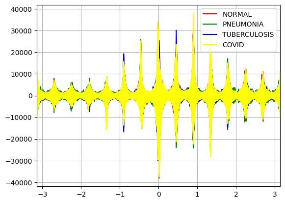
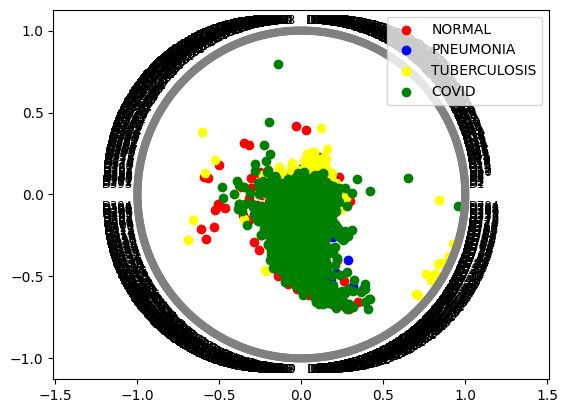
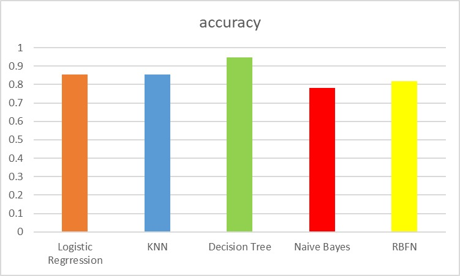

# Chest X-Ray Detection

A small, reproducible machine-learning project based on the files in this folder. It trains and evaluates traditional classifiers on the provided labeled, flattened 28×28 grayscale feature table and optionally serves a Streamlit upload demo.

> **Research/education only.** This model is not a medical device, has not been clinically validated, and must not be used to diagnose or treat anyone. A prediction is not a substitute for review by a qualified clinician.

## Dataset included in this project

The report lists 3,500 Normal, 3,875 Pneumonia, 700 Tuberculosis, and 3,616 COVID images. These counts total **11,691**, rather than 11,700. The default `lbddataset.csv` contains 784 feature columns (`D1`…`D784`) and a `DISEASE` target column. The code reads labels from that target column and normalizes `TB`/`TUBERCULOSIS` and common COVID label variants. A 2023 ChatGPT conversation about this project confirms that you were experimenting with an SVM on CSV features, an 80/20 split with `random_state=42`, and classification metrics. Accordingly, linear SVM is included in the model comparison.

Other CSVs in the folder are alternate resolutions, class-specific exports, or binary datasets. They are not automatically combined. To choose a different compatible labeled table, pass its path to `--data`; it must contain one row per sample, numeric feature columns, and a label column.

## Plots from the project presentation

These figures were extracted from the original project presentation. The classifier accuracy figure is a historical presentation graphic; it is not generated by the current training script. Current model results are written to `artifacts/metrics.json` and `artifacts/classification_report.csv` after training.

### Andrews curves



Individual class plots: [Normal](docs/plots/andrews_normal.jpeg), [Pneumonia](docs/plots/andrews_pneumonia.jpeg), [Tuberculosis](docs/plots/andrews_tuberculosis.jpeg), [COVID](docs/plots/andrews_covid.jpeg). The presentation also contains a [three-disease-class comparison](docs/plots/andrews_disease_classes.jpeg).

### Radviz plots



Individual disease plots: [COVID](docs/plots/radviz_covid.jpeg), [Pneumonia](docs/plots/radviz_pneumonia.jpeg), [Tuberculosis](docs/plots/radviz_tuberculosis.jpeg). The presentation also contains a [three-disease-class comparison](docs/plots/radviz_disease_classes.jpeg).

### Historical classifier accuracy



The project report describes resizing grayscale images to 28×28, Otsu-based segmentation, convex hulls, Canny edges, and evaluating classifiers including KNN, decision trees, and logistic regression. It also describes K-fold validation, and your 2023 SVM conversation shows an attempted five-fold stratified setup. This reconstructed training script compares classifiers using an 80/20 stratified holdout; it does not recreate image segmentation or cross-validation. The supplied feature CSV has no source filenames or patient identifiers, so the split cannot prevent patient-level leakage where a patient has multiple images. Results should therefore be treated as exploratory. Missing numeric feature values are imputed inside the training pipelines; missing labels and non-numeric feature content are rejected.

## Setup

Python 3.10 or newer is recommended.

```bash
python -m venv .venv
# Windows PowerShell: .venv\Scripts\Activate.ps1
# macOS/Linux: source .venv/bin/activate
python -m pip install -r requirements.txt
```

## Train and compare models

```bash
python -m src.train --data "lbddataset.csv" --output-dir artifacts
```

The command makes a reproducible stratified train/test split, fits preprocessing and classifiers, and writes `model.joblib`, `metrics.json`, and `classification_report.csv` into `artifacts/`. The generated model files are ignored by Git; regenerate them locally using the command above. Metrics include accuracy, macro and weighted F1, and a confusion matrix. No reported accuracy is hard-coded.

To use a different labeled dataset:

```bash
python -m src.train --data "lbddataset(0,1).csv" --label-column DISEASE
```

## Run the upload demo

```bash
streamlit run app.py
```

The app loads `artifacts/model.joblib`. Train first. Upload a chest X-ray image and the app converts it to grayscale, resizes it to 28×28, and flattens it. This preprocessing is an explicit assumption based on the report; confirm that it exactly matches the preprocessing used to produce the training CSV before interpreting predictions. Some X-ray collections use inverted pixel polarity, cropping, normalization, or other transformations.

## Project layout

```text
app.py                   Streamlit image upload demo
src/data.py              CSV validation, labels, image preprocessing
src/models.py            Reproducible model pipelines
src/train.py             Training, evaluation, saved artifacts
src/predict.py           Reusable loading and prediction helpers
requirements.txt
```

## Add to Git

Keep the existing research documents and datasets if you intend to version them, but consider distributing the large CSV files with Git LFS or a dataset host. Confirm you have the right to redistribute each source dataset; preserve its original attribution and license. Generated models and metrics are excluded by `.gitignore`.

```bash
git init
git add .
git status
git commit -m "Add chest X-ray disease classification project"
```

Before committing, review `git status` and ensure private or restricted data is not being uploaded.
